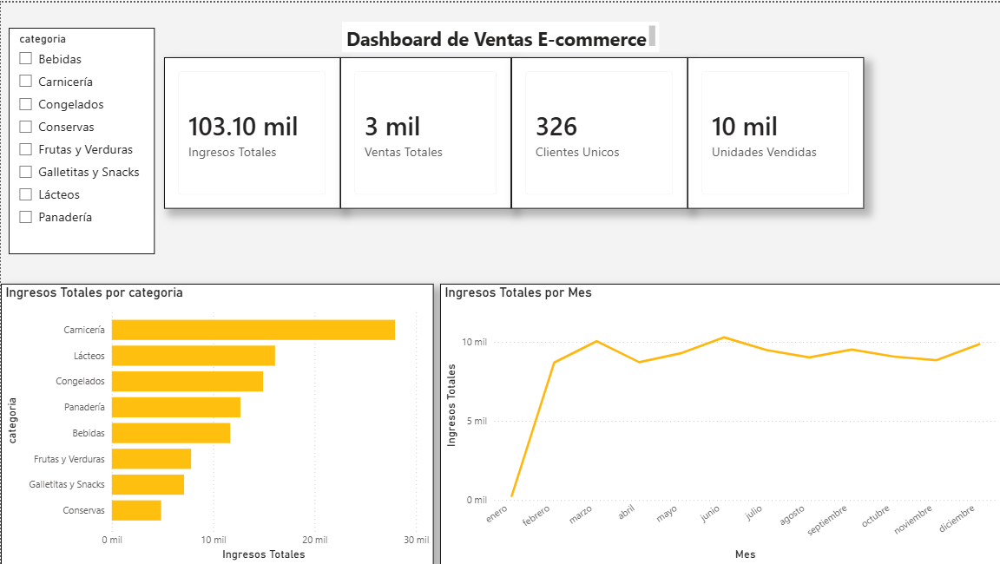
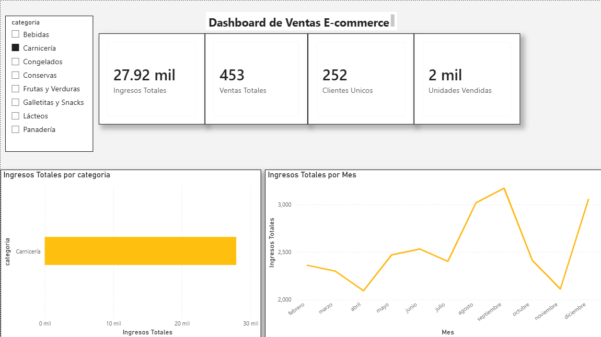

## Dashboard




# Ecommerce BI Dashboard

Proyecto de análisis de ventas para un dataset de e-commerce, usando PostgreSQL, Python y Power BI.

## Objetivo

Construir un flujo de Business Intelligence para cargar, limpiar, modelar y visualizar datos de ventas.

## Herramientas utilizadas

- PostgreSQL
- Python
- Pandas
- Power BI
- SQL
- Git / GitHub

## Estructura del proyecto

```text
data/
python/
sql/
powerbi/
screenshots/
README.md

